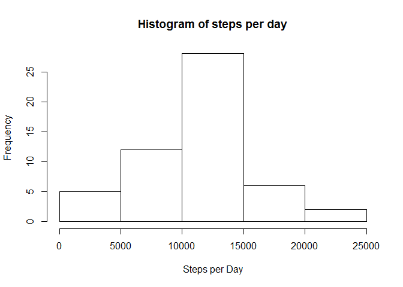
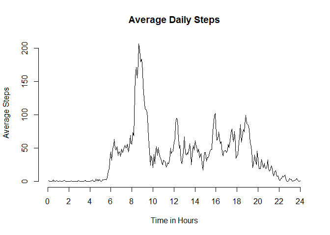
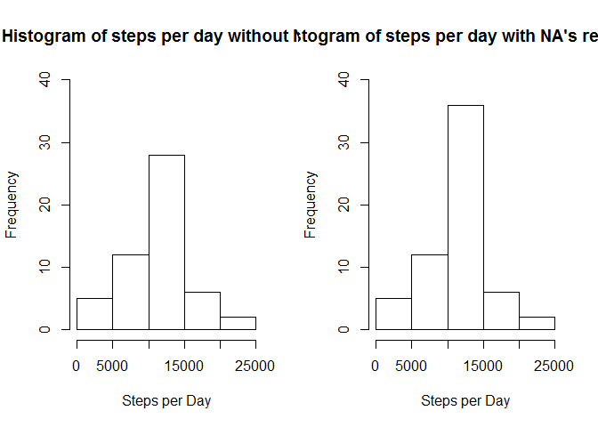
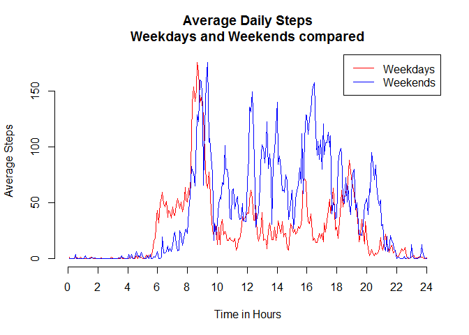

# Reproducible Research: Peer Assessment 1


## Loading and preprocessing the data 
### 1. Load the data
Read the data directly from the .zip file with the * **unz()*** function

```r
data <- read.csv(unz("activity.zip", "activity.csv"))
```
### 2. Process/transform the data (if necessary) into a format suitable for your analysis
Check the structure of the data to make sure is in the format required. Using the output of ***str()***

```r
str(data)
```

```
## 'data.frame':	17568 obs. of  3 variables:
##  $ steps   : int  NA NA NA NA NA NA NA NA NA NA ...
##  $ date    : Factor w/ 61 levels "2012-10-01","2012-10-02",..: 1 1 1 1 1 1 1 1 1 1 ...
##  $ interval: int  0 5 10 15 20 25 30 35 40 45 ...
```
The header was read correctly and the names match the variables. 
The *date* was read as factors instead of date class and intervals were read as integer instead of factors. Fix with following code

```r
data$date <- as.Date(data$date)
data$interval <- as.factor(data$interval)
```
## What is mean total number of steps taken per day?
### 1. Make a histogram of the total number of steps taken each day
To obtain the number of steps per day we can summarize with the ***aggregate()*** function

```r
daily_steps <- aggregate(steps ~ date, data, sum)
```
We can generate the histogram now

```r
hist(daily_steps$steps, main = "Histogram of steps per day", xlab = "Steps per Day")
```

 

### 2. Calculate and report the mean and median total number of steps taken per day
The ***summary()*** function can be used to provide *mean* and *median* values in one call and provides information on number of NA's 

```r
summary(daily_steps)
```

```
##       date                steps      
##  Min.   :2012-10-02   Min.   :   41  
##  1st Qu.:2012-10-16   1st Qu.: 8841  
##  Median :2012-10-29   Median :10765  
##  Mean   :2012-10-30   Mean   :10766  
##  3rd Qu.:2012-11-16   3rd Qu.:13294  
##  Max.   :2012-11-29   Max.   :21194
```
Or we can call ***mean()*** and ***median()*** directly

```r
mean(daily_steps$steps, na.rm = TRUE)
```

```
## [1] 10766.19
```

```r
median( daily_steps$steps, na.rm = TRUE)
```

```
## [1] 10765
```
## What is the average daily activity pattern?
### 1. Make a time series plot of the 5-minute interval (x-axis) and the average number of steps taken, averaged across all days (y-axis)
We need to generate a time series plot of the daily 5 minutes interval average. We can use the ***aggregate()*** function to calculate mean per by interval factor

```r
mean_interval_steps <- aggregate(steps ~ interval, data, mean)
```
Now we can generate a time series plot with the ***plot.ts()*** function and fix the axis so it shows hours instead of 5 minutes intervals

```r
plot.ts(mean_interval_steps$steps,
        main="Average Daily Steps", 
        ylab = "Average Steps", 
        xlab = "Time in Hours",
        axes = FALSE)  # Don't draw axes
axis(1,seq(0, 288, 24), label = seq(0,24, 2))
axis(2)
```

 

### 2. Which 5-minute interval, on average across all the days in the dataset, contains the maximum number of steps?
We need to find out the maximum average with the ***max()*** function and extract the interval that matches that max

```r
mean_interval_steps[mean_interval_steps$steps==max(mean_interval_steps$steps),]
```

```
##     interval    steps
## 104      835 206.1698
```
Interval 835 corresponds to the 104th interval of the day, between *8:35am* and *8:40am* 

## Imputing missing values

### 1. Calculate and report the total number of missing values in the dataset (i.e. the total number of rows with NAs)
Since there is only one column with missing values we can simply use ***sum()*** and ***is.na()*** fucnctions

```r
sum(is.na(data$steps))
```

```
## [1] 2304
```

### 2. Devise a strategy for filling in all of the missing values in the dataset. The strategy does not need to be sophisticated. For example, you could use the mean/median for that day, or the mean for that 5-minute interval, etc.
Since the strategy does not have to be complex, I will use the mean for the specific interval to replace the NA's. Since the mean is not an integer number, it will be rounded to reflect an integer number of steps

```r
mean_interval_steps$steps <- round(mean_interval_steps$steps)
```

### 3. Create a new dataset that is equal to the original dataset but with the missing data filled in.
We will go row by row, if *steps* is NA we will replace the value with the mean steps of *avg_intreval_steps* for the particular interval. The ***which()*** functions finds the replacement value.

```r
head(data)
```

```
##   steps       date interval
## 1    NA 2012-10-01        0
## 2    NA 2012-10-01        5
## 3    NA 2012-10-01       10
## 4    NA 2012-10-01       15
## 5    NA 2012-10-01       20
## 6    NA 2012-10-01       25
```

```r
new_data <- data
for (i in 1:nrow(new_data)) {
        if (is.na(new_data$steps[i]))
                new_data$steps[i] <- mean_interval_steps$steps[which(new_data$interval[i] == mean_interval_steps$interval)]
        }
head(new_data)
```

```
##   steps       date interval
## 1     2 2012-10-01        0
## 2     0 2012-10-01        5
## 3     0 2012-10-01       10
## 4     0 2012-10-01       15
## 5     0 2012-10-01       20
## 6     2 2012-10-01       25
```

```r
sum(is.na(new_data$steps))
```

```
## [1] 0
```

### 4. Make a histogram of the total number of steps taken each day and Calculate and report the mean and median total number of steps taken per day. Do these values differ from the estimates from the first part of the assignment? What is the impact of imputing missing data on the estimates of the total daily number of steps?
Calculate the total number of steps like we did for the first part of the assignment with the updated data set

```r
new_daily_steps <- aggregate(steps ~ date, new_data, sum)
```

Draw histograms next to each other to compare with the same scale

```r
par(mfrow=c(1,2))
hist(daily_steps$steps, 
     main = "Histogram of steps per day without NA's", 
     xlab = "Steps per Day", ylim=c(0,40))
hist(new_daily_steps$steps, 
     main = "Histogram of steps per day with NA's replaced",
     xlab = "Steps per Day", ylim=c(0,40))
```

 
Call ***mean()*** and ***median()*** directly to calculate daily values

```r
mean(new_daily_steps$steps)
```

```
## [1] 10765.64
```

```r
median( new_daily_steps$steps)
```

```
## [1] 10762
```
The mean changed by the percentage below 

```r
abs(mean(daily_steps$steps, na.rm=T)-mean(new_daily_steps$steps))/mean(daily_steps$steps, rm.na=T)
```

```
## [1] 5.102409e-05
```

The median changed by the percentage below

```r
abs(median(daily_steps$steps)-median(new_daily_steps$steps))/median(daily_steps$steps)
```

```
## [1] 0.0002786809
```
The method of imputing the rounded mean on every one of the 2304 missing values has increased the total number of daily steps by the value shown below

```r
sum(new_daily_steps$steps) - sum(daily_steps$steps)
```

```
## [1] 86096
```

## Are there differences in activity patterns between weekdays and weekends?
We need to subset the data into weekdays and weekend. We can use the ***subset()*** and ***weekdays()*** functions for this


```r
weekdays_data <- subset(data, weekdays(data$date)!="Saturday" & 
                                weekdays(data$date) != "Sunday")
weekend_data <- subset(data, weekdays(data$date)=="Saturday" | 
                                weekdays(data$date) == "Sunday")
```

Now we can aggregate each subset and plot

```r
weekday_interval_steps <- aggregate(steps ~ interval, weekdays_data, mean)
weekend_interval_steps <- aggregate(steps ~ interval, weekend_data, mean)

plot.ts(weekday_interval_steps$steps,
        main="Average Daily Steps\nWeekdays and Weekends compared", 
        ylab = "Average Steps", 
        xlab = "Time in Hours",
        axes = FALSE,
        col="red") 
par(new=T)
plot.ts(weekend_interval_steps$steps,
        axes=FALSE,
        xlab=NULL,
        ylab=NULL,
        col="blue") 
axis(1,seq(0, 288, 24), label = seq(0,24, 2))
axis(2)
legend("topright", c("Weekdays", "Weekends"), lty=c(1,1), col=c("red", "blue"))
```

 

There is less activity on the early hours on the weekends ~ 5 to 8am, most likely because people sleeping and there less activity on the weekdays starting around 10am, most likely because that is when people arrive to work or classes and spend less time walking
